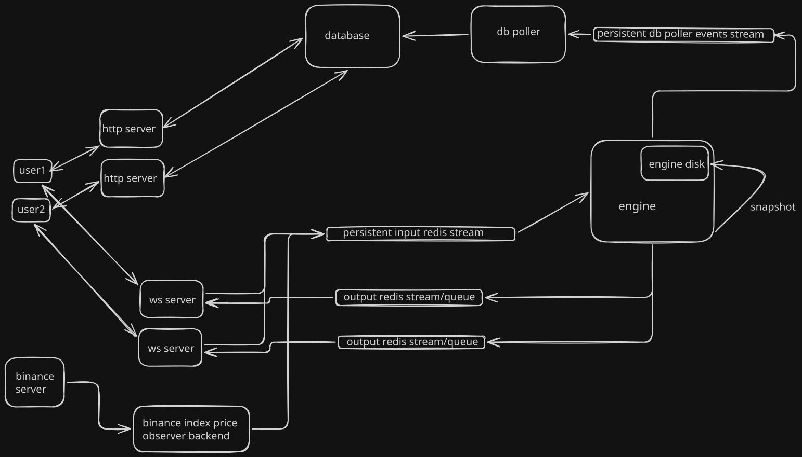

# Perpetual Futures Exchange

Event-sourced perpetual futures exchange architecture with deterministic recovery, in-memory matching, and real-time WebSocket updates.

**Tech Stack:** TypeScript, Redis, WebSocket, PostgreSQL, Bun, Zod, Turborepo

## Architecture

## Architecture Notes

- Engine state is kept in memory to maximize performance.
- Snapshot + input stream replay keeps the engine reliable and deterministic on restart.
- Persistent DB poller event stream keeps database state deterministic on DB poller restart.
- Systems are designed to be idempotent to safely handle at-least-once delivery.
- Engine is currently single-threaded.
- A persistent single input stream acts as the source of truth.
- Balances, orderbook, and positions live inside the engine.
- Orders and fills are persisted in the database.
- WebSocket server supports:
  - Direct requests to the engine.
  - Real-time subscriptions for updates.

- HTTP server handles database-backed requests.
